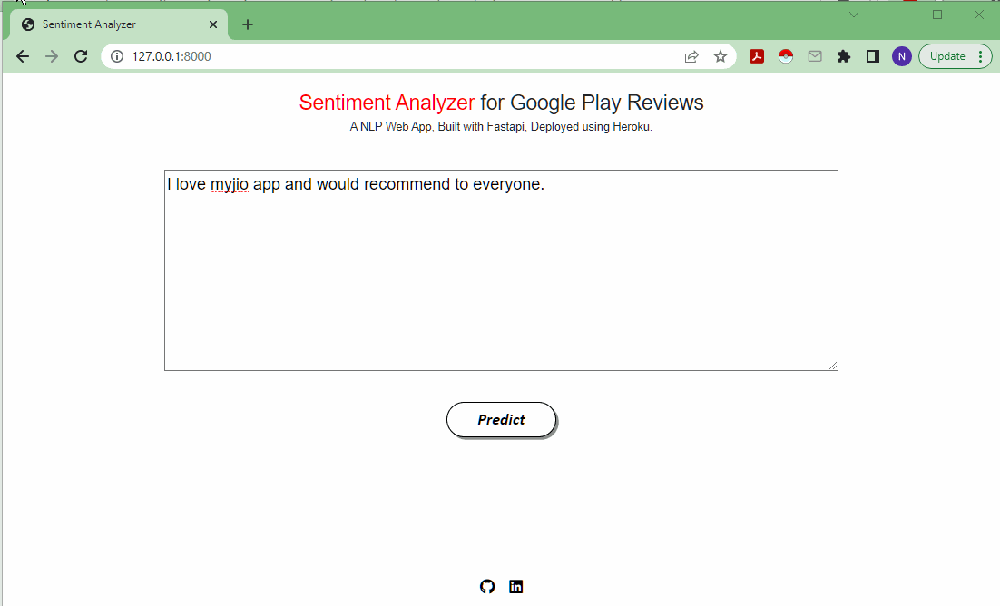

# Sentiment-Analysis-Google-Play-App-Reviews

The aim of this project is to create a custom dataset for sentiment analysis. Use the data to fine-tune a BERT model and deploy your NLP model as an API.


• This repository consists of files required for end to end implementation of Sentiment Analysis of Google Play App Reviews ___Natural Language Processing Web App___ created with ___FastApi.

## setup
- Clone the repository : https://github.com/ni3choudhary/Sentiment-Analysis-Google-Play-App-Reviews.git
- Inside the project root directory, Create Python Virtual Environment and activate it using below commands 
```console
$ python3 -m venv env
``` 

Activate Virtual Environment
```console
$ .env/bin/activate 
          OR
$ .\env\Scripts\activate
```
Install Libraries using below command
```console
$ pip install -r requirements.txt
```

- Run jupyter notebooks to get the necessary files if you try to build it from scratch.

## The Files explained
Use the files as following to create the project from scratch or create your own project in an adapted way.

**1. scrape_app_information.ipynb** to scrape top 15 app information  from the productivity category using google-play-scraper package.

**2. scrape_app_reviews.ipynb** to scrape more than 15k user reviews from those 15 productivity apps using google-play-scraper package.

**3. sentiment_analysis_with_bert_and_hugging_face_using_torch.ipynb** to fine-tune BERT for sentiment analysis and save the best model for deployment purpose. Here, you'll do the required text preprocessing (special tokens, padding, and attention masks) and build a Sentiment Classifier using Transformers.

**4. sentiment_analyzer/assets/** please put saved model file named best_model_state.bin into this directory.

**5. sentiment_analyzer/classifier/sentiment_classifier.py** to create a classifier that uses the BERT model.

**6. sentiment_analyzer/classifier/model.py** to create an interface to abstract the inference logic. It exposes a single predict() method with all the text processing required to build a sentiment analysis model.

- Now Inside sentiment_analyzer directory run **api.py** on terminal to start local server.
```console
$ uvicorn api:app --reload
```

## App Demo



• Please do ⭐ the repository, if it helped you in anyway.

